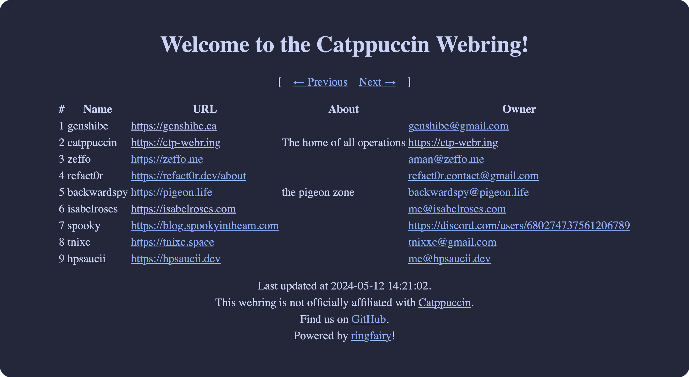

<h3 align="center">
	<br/>
	
	The Catppuccin <a href="https://en.wikipedia.org/wiki/Webring">Webring</a>
	
</h3>

<p align="center">
	<a href="https://github.com/isabelroses/catppuccin-webring/stargazers"></a>
	<a href="https://github.com/isabelroses/catppuccin-webring/issues"></a>
	<a href="https://github.com/isabelroses/catppuccin-webring/contributors"></a>
</p>

<p align="center">
	
</p>

## 🙋 FAQ

-	Q: **_"How can I join?"_**\
	A: Feel free to add yourself to the webring by adding a new entry to *`websites.json`*. The only required information is your site's **URL** and your desired **slug**. Optionally, you can also include the following for your site listing:

    - Full **title** of your site
    - A brief **description** of your site
    - Some form of **contact info** (email, fedi, etc)
    - If you have one, your **RSS** link

    An entry might look like:
    
    ```json
    {
      "name": "Example Website",
      "slug": "example",
      "about": "I'm an example!!!",
      "url": "https://example.com/",
      "rss": "https://example.com/index.xml",
      "owner": "person@example.com"
    }
    ```
    
    After that, add the webring HTML somewhere on your site, like the sidebar or footer.
    Remember to replace "YOUR_SLUG" with your actual slug: 
    
    ```html
    <a href="https://ctp-webr.ing/YOUR_SLUG/previous">&larr;-</a><a href="https://ctp-webr.ing/">Catppuccin webring</a><a href="https://ctp-webr.ing/YOUR_SLUG/next">&rarr;</a>  
    ```

## 💝 Thanks to

- [Isabel Roses](https://github.com/isabelroses)

&nbsp;

<p align="center">
	
</p>

<p align="center">
	Copyright &copy; 2021-present <a href="https://github.com/catppuccin" target="_blank">Catppuccin Org</a>
</p>

<p align="center">
	<a href="https://github.com/catppuccin/catppuccin/blob/main/LICENSE"></a>
</p>
